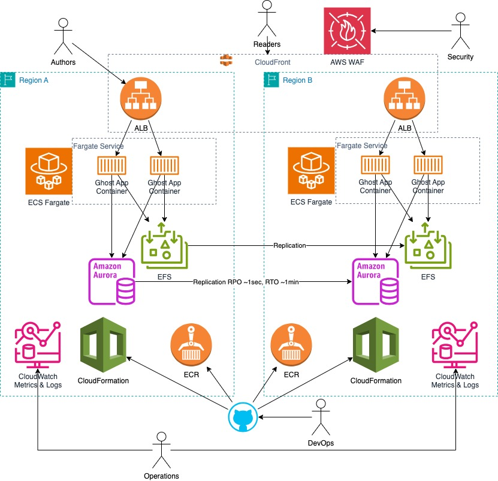

# ghost-aws-ha

## Architecture

s

### Goals 

1. The application should be able to scale depending on the load

According to [Ghost FAQ](https://ghost.org/docs/faq/clustering-sharding-multi-server/) the application does not support horizontal scaling in any form. Ghost is designed to run the only instance of the application.

In order to address the scalability issue, CDN is deployed in front ofthe applicaiton, which should takle load spikes. Number of Authors is limited, and will be handled with the single instance.

2. The application must return consistent results across sessions

In order to address the requirement, not only the MySQL compatible database is used, but also Elastic File System is mounted to the application container, so that data is not affected with restarts or recreation of the application container.

3. The implementation should be built in a resilient manner

Since Ghost app does not support multiple instances of the app running simultaniously, in order to achieve maximum availability and disaster recovery capabilities in case of a regional failure the following has been implemented:

a. EFS, MySQL, Containers, NAT, VPC Endpoints are configured to run in multiple availability zones in the primary and secondary region.
b. Pilot light Disaster Recovery architecture has been implemented, ensuring MySQL, EFS and container images are replicated to the secondary region.
c. AWS CloudFront is configured with Origin Groups to fail over to the second region in case it cannot serve data from cache and primary region returns supported 5xx errors. AWS CloudFront's cache will give time for the second region to be promoted as primary.
d. In order to promote secondary region to primary, EFS syncronizaton should be disabled to make replica in the secondary region writable, MySQL in the secondary region should be promoted to be writable. NB! No automation for the failower has been developed.

4. Observability must be taken into account when implementing the solution

Ghost has beend configured to stream logs to STDOUT, and containers are configured to deliver the logs to AWS CloudWatch.
No extra metrics except standard provided by AWS CloudWatch has been implemented.
Suggested improvements after the POC phase would be ALB and CloudFront logs. Aurora might have more extensive loging. Custom CloudWatch dashboards are to be utilized for environment state visualization.

5. The deployment of the application and environment should be automated

All instastructura is implemented a a set of CloudFormation templates with several shell scripts allowing to implement deploy either single region or High Availability configuration.

## Deployment from local env

### Prerequisites

1. Bash, [AWS CLI] (https://docs.aws.amazon.com/cli/latest/userguide/getting-started-install.html), [AWS SAM] (https://docs.aws.amazon.com/serverless-application-model/latest/developerguide/install-sam-cli.html) installed
2. AWS user with admin privileges in an AWS account
3. AWS environment variables AWS_PROFILE or alternatively AWS_ACCESS_KEY_ID and AWS_SECRET_ACCESS_KEY to make CLI work. See https://docs.aws.amazon.com/cli/latest/userguide/cli-configure-envvars.html for details.

### Deployment

NB: The insfrastructure use HTTP-only setup for simplicity.

#### Globals
In order to configure global resources - edit configuration section in the `deploy-base.sh` and run it locally. It will create:
- AWS Role to run GitHub Actions. Note AWS Role Arn in console for furhter use with GitHub Actions
- AWS repository for docker containers

#### Dev environment
Any single region environment is created with `deploy-dev.sh`. Edit configuration section and run it locally to:
- Build container image and push it to ECR
- Create or update infrastructure: VPC, Aurora MySQL, EFS, ECS Fargate, and supporting resources
- Newly built docker image will be used

#### HA environment
High availability environment is created with `deploy-ha.sh`. Edit configuration section and run it locally to:
- Create or update infrastructure in both primary and secondary regions: VPC, Aurora MySQL, EFS, ECS Fargate, and supporting resources
- Setup syncronization of EFS and Aurora MySQL
- Create CloudFront distribution with OriginGroup using respectivelu Primary and secondary regions

### Mutli-Region Disaser Recovery
1. Start HA stack, 
2. Open Loadbalancer address in the primary region via HTTP and type "/ghost/setup" page to setup Ghost
3. Crete a two pages A and B using primary LB
4. Ensure CloudFront shows page A. Don't open page B, so that CloudFront doesn't cache it
5. Stop primary - test if CloudFront shows page A. It should be cached, and still available. Try open page B, it should show error.
6. Make EFS and MySQL in the second region wriable, start container instance in the secondary region.
7. CloudFront should start showing page B, as well as other pages.
8. Create post using load balancer in the secondary region to ensur it works as expected

### Mutli-Region Recovery after Disaser Recovery
To be defined